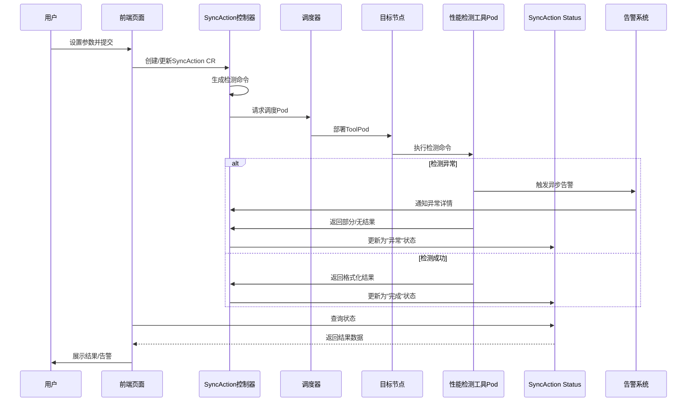

# 一键通信检测方案

## 问题背景

在深度学习领域，分布式训练已成为处理大规模数据集和复杂模型的关键技术。然而，分布式系统的复杂性使得训练过程中容易出现各类故障，如节点内硬件连接异常、节点间通信中断、存储挂载失效以及 GPU 和网卡故障等。为保障分布式训练任务的稳定性和可靠性，本方案针对节点内 NVLink 检查、节点间 RoCE/IB 通信检查、存储挂载检查、GPU ECC Error 检查与重置、GPU 掉卡、网卡掉卡等新特性，提出全面的诊断与容错技术方案。

待解决问题：
1.  通信库性能检测。
2.  rama网络连通性检测。
3.  保存历史检测数据。

## 竞品分析

天翼云

**RDMA网络性能检测**


**通讯库性能检测**


**服务器检测**


**检测历史**


## 解决方案

### 应用场景

- 集群创建完成后，执行整体的一个环境检测，辅助进行异常修复。（硬件，软件，特定需求）。
- 周期巡查，出现问题的节点并进行隔离。
- 根据基准节点做对比测试，（增加新的节点和一致性需求），
- 根据任务申请的资源做健康检测，保证训练的稳定性。


### 产品交互

检测的时机是什么？

正常验证
 - 目标节点存在任务占用，则等待，等资源存在在执行检测任务
 - 目标节点不存在任务占用，申请资源后正常执行检测任务。
强制验证
 - 目前节点无论是否存任务占用，都直接执行检测任务（检测过程会影响正在使用的任务）


> 注：NVIDIA_VISIBLE_DEVICES 这个环境变量设置默认禁用的场景是在trainjob和notebook 中。对syncaction 不存在影响。

### 实现流程

**通过CR实现**：
1. 通过页面参数传递到 syncaction CR 中，根据参数拼凑完整的检测命令。
2. 通过调度器将性能检测工具pod下发到对应的目标节点上执行。
3. 检验过程中，出现无法自动恢复的异常，执行告警逻辑.
4. 解析格式化检测结果后写入status。
5. 页面通过查询CR 的status来展示结果。
  




CR 实例如下：
(具体cr字段根据实现流程中进行调整)

```bash
apiVersion: system.hero.ai/v1alpha1
kind: SyncAction
metadata:
  name: syncaction-sample
spec:
  name: HealthCheckAction
  HealthCheckSpec: 
    Type: ["RDMA","GPU"] # 检测类型
    typeParameter：      # 检测参数
      serverNode: "node_1"
      serverDeviceName : mlx5_1
      clientNode: "node_2"
      clientDeviceName : mlx5_1  
    recover: true # 是否自动恢复
status:
  satrtTime:
  endTime: 
  checkResult: # 查询结果
    [{type: "RDMA"
    result: "success"
    message: {检测结果}
    recover: "success"},
    {type: "GPU"
    result: "fail"
    message: {检测结果}
    recover: "success"}]
```
CR 运行状态: **"Failed","Succeed","Syncing**

检测范围：**集群、资源池、节点、pod。**

查询周期：**一次执行、循环执行**

### 检测项和容错

#### 节点内网络接口状态

检测方法：

```bash
ip link show

1: lo: <LOOPBACK,UP,LOWER_UP> mtu 65536 qdisc noqueue state UNKNOWN mode DEFAULT group default qlen 1000
    link/loopback 00:00:00:00:00:00 brd 00:00:00:00:00:00
2: ens81f0np0: <BROADCAST,MULTICAST,SLAVE,UP,LOWER_UP> mtu 1500 qdisc mq master bond0 state UP mode DEFAULT group default qlen 1000
    link/ether be:1b:9b:0f:c4:cd brd ff:ff:ff:ff:ff:ff permaddr 90:5a:08:21:5a:78
    altname enp23s0f0np0
3: ens81f1np1: <BROADCAST,MULTICAST,SLAVE,UP,LOWER_UP> mtu 1500 qdisc mq master bond0 state UP mode DEFAULT group default qlen 1000
    link/ether be:1b:9b:0f:c4:cd brd ff:ff:ff:ff:ff:ff permaddr 90:5a:08:21:5a:79
    altname enp23s0f1np1
4: usb0: <BROADCAST,MULTICAST> mtu 1500 qdisc noop state DOWN mode DEFAULT group default qlen 1000
    link/ether ca:0b:65:f6:7d:7e brd ff:ff:ff:ff:ff:ff
5: enp46s0np0: <BROADCAST,MULTICAST,UP,LOWER_UP> mtu 4200 qdisc mq state UP mode DEFAULT group default qlen 1000
```

恢复方法：

```bash
ip link set eth0 down && ip link set usb0 up

4: usb0: <BROADCAST,MULTICAST,UP,LOWER_UP> mtu 1500 qdisc fq_codel state UNKNOWN mode DEFAULT group default qlen 1000
    link/ether ca:0b:65:f6:7d:7e brd ff:ff:ff:ff:ff:ff
```

状态变成UNKNOWN，未正常变成UP.

#### 节点存储点挂载检测

检测方法：

```bash
df -h 

Filesystem                         Size  Used Avail Use% Mounted on
tmpfs                              101G  8.4M  101G   1% /run
/dev/mapper/ubuntu--vg-ubuntu--lv  444G  200G  244G  46% /
tmpfs                              504G  962M  503G   1% /dev/shm
tmpfs                              5.0M     0  5.0M   0% /run/lock
/dev/sda2                          2.0G  404M  1.4G  23% /boot
/dev/sda1                          1.1G  6.1M  1.1G   1% /boot/efi
tmpfs                              101G  4.0K  101G   1% /run/user/22126
tmpfs                              101G  4.0K  101G   1% /run/user/22327
/9920_DPC_Test                      80T   38T   43T  47% /data
/dev/nvme0n1p1                     3.5T  3.3T  283G  93% /data0
tmpfs                              101G  4.0K  101G   1% /run/user/1000
```

恢复方法：

```bash
mount /dev/sdb1 /mnt/data  # 单独挂载特定设备
```

#### RoCE/IB 接口状态

检测方法：

```bash
ibdev2netdev  # 显示IB设备与网络设备映射关系和网卡状态

mlx5_0 port 1 ==> enp46s0np0 (Up)
mlx5_1 port 1 ==> enp49s0np0 (Up)
mlx5_2 port 1 ==> enp94s0np0 (Up)
mlx5_3 port 1 ==> enp95s0np0 (Up)
mlx5_4 port 1 ==> ens97np0 (Up)
mlx5_5 port 1 ==> enp165s0np0 (Up)
mlx5_6 port 1 ==> enp168s0np0 (Up)
mlx5_7 port 1 ==> enp206s0np0 (Up)
mlx5_8 port 1 ==> enp209s0np0 (Up)

show_gids

DEV     PORT    INDEX   GID                                     IPv4            VER     DEV
---     ----    -----   ---                                     ------------    ---     ---
mlx5_0  1       0       fe80:0000:0000:0000:eaeb:d3ff:fedf:3e0e                 v1      enp46s0np0
mlx5_0  1       1       fe80:0000:0000:0000:eaeb:d3ff:fedf:3e0e                 v2      enp46s0np0
mlx5_0  1       2       0000:0000:0000:0000:0000:ffff:0a01:4601 10.1.70.1       v1      enp46s0np0
mlx5_0  1       3       0000:0000:0000:0000:0000:ffff:0a01:4601 10.1.70.1       v2      enp46s0np0
mlx5_1  1       0       fe80:0000:0000:0000:5aa2:e1ff:fea9:d1be                 v1      enp49s0np0
mlx5_1  1       1       fe80:0000:0000:0000:5aa2:e1ff:fea9:d1be                 v2      enp49s0np0
mlx5_1  1       2       0000:0000:0000:0000:0000:ffff:0a01:4602 10.1.70.2       v1      enp49s0np0
mlx5_1  1       3       0000:0000:0000:0000:0000:ffff:0a01:4602 10.1.70.2       v2      enp49s0np0
mlx5_2  1       0       fe80:0000:0000:0000:5aa2:e1ff:fe86:4334                 v1      enp94s0np0
mlx5_2  1       1       fe80:0000:0000:0000:5aa2:e1ff:fe86:4334                 v2      enp94s0np0
mlx5_2  1       2       0000:0000:0000:0000:0000:ffff:0a01:4603 10.1.70.3       v1      enp94s0np0
mlx5_2  1       3       0000:0000:0000:0000:0000:ffff:0a01:4603 10.1.70.3       v2      enp94s0np0
mlx5_3  1       0       fe80:0000:0000:0000:5aa2:e1ff:fec9:4b08                 v1      enp95s0np0
mlx5_3  1       1       fe80:0000:0000:0000:5aa2:e1ff:fec9:4b08                 v2      enp95s0np0
mlx5_3  1       2       0000:0000:0000:0000:0000:ffff:0a01:4604 10.1.70.4       v1      enp95s0np0
mlx5_3  1       3       0000:0000:0000:0000:0000:ffff:0a01:4604 10.1.70.4       v2      enp95s0np0
mlx5_4  1       0       fe80:0000:0000:0000:966d:aeff:fe64:0b3a                 v1      ens97np0
mlx5_4  1       1       fe80:0000:0000:0000:966d:aeff:fe64:0b3a                 v2      ens97np0
mlx5_4  1       2       fe80:0000:0000:0000:966d:aeff:fe64:0b3a                 v1      vlan0.88
mlx5_4  1       3       fe80:0000:0000:0000:966d:aeff:fe64:0b3a                 v2      vlan0.88
mlx5_4  1       4       0000:0000:0000:0000:0000:ffff:0a01:5a01 10.1.90.1       v1      vlan0.88
mlx5_4  1       5       0000:0000:0000:0000:0000:ffff:0a01:5a01 10.1.90.1       v2      vlan0.88
mlx5_4  1       6       0000:0000:0000:0000:0000:ffff:0a01:5a65 10.1.90.101     v1      vlan0.88
mlx5_4  1       7       0000:0000:0000:0000:0000:ffff:0a01:5a65 10.1.90.101     v2      vlan0.88
mlx5_5  1       0       fe80:0000:0000:0000:966d:aeff:fe8e:3ecc                 v1      enp165s0np0
mlx5_5  1       1       fe80:0000:0000:0000:966d:aeff:fe8e:3ecc                 v2      enp165s0np0
mlx5_5  1       2       0000:0000:0000:0000:0000:ffff:0a01:4605 10.1.70.5       v1      enp165s0np0
mlx5_5  1       3       0000:0000:0000:0000:0000:ffff:0a01:4605 10.1.70.5       v2      enp165s0np0
mlx5_6  1       0       fe80:0000:0000:0000:5aa2:e1ff:fec9:3cf8                 v1      enp168s0np0
mlx5_6  1       1       fe80:0000:0000:0000:5aa2:e1ff:fec9:3cf8                 v2      enp168s0np0
mlx5_6  1       2       0000:0000:0000:0000:0000:ffff:0a01:4606 10.1.70.6       v1      enp168s0np0
mlx5_6  1       3       0000:0000:0000:0000:0000:ffff:0a01:4606 10.1.70.6       v2      enp168s0np0
mlx5_7  1       0       fe80:0000:0000:0000:5aa2:e1ff:fec9:48e0                 v1      enp206s0np0
mlx5_7  1       1       fe80:0000:0000:0000:5aa2:e1ff:fec9:48e0                 v2      enp206s0np0
mlx5_7  1       2       0000:0000:0000:0000:0000:ffff:0a01:4607 10.1.70.7       v1      enp206s0np0
mlx5_7  1       3       0000:0000:0000:0000:0000:ffff:0a01:4607 10.1.70.7       v2      enp206s0np0
mlx5_8  1       0       fe80:0000:0000:0000:5aa2:e1ff:fea9:d1c6                 v1      enp209s0np0
mlx5_8  1       1       fe80:0000:0000:0000:5aa2:e1ff:fea9:d1c6                 v2      enp209s0np0
mlx5_8  1       2       0000:0000:0000:0000:0000:ffff:0a01:4608 10.1.70.8       v1      enp209s0np0
mlx5_8  1       3       0000:0000:0000:0000:0000:ffff:0a01:4608 10.1.70.8       v2      enp209s0np0
```

恢复方法：nil

#### NVLink 状态检测

检测方法：

```bash
vidia-smi nvlink -s

GPU 0: NVIDIA A100-SXM4-80GB (UUID: GPU-08f3d78c-db20-d6b5-43ac-d4c51f52b61d)
         Link 0: 25 GB/s
         Link 1: 25 GB/s
         Link 2: 25 GB/s
         Link 3: 25 GB/s
         Link 4: 25 GB/s
         Link 5: 25 GB/s
         Link 6: 25 GB/s
         Link 7: 25 GB/s
         Link 8: 25 GB/s
         Link 9: 25 GB/s
         Link 10: 25 GB/s
         Link 11: 25 GB/s
GPU 1: NVIDIA A100-SXM4-80GB (UUID: GPU-5c43d80e-c8c4-fe93-63de-fe26181f6c76)
         Link 0: 25 GB/s
         Link 1: 25 GB/s
         Link 2: 25 GB/s
         Link 3: 25 GB/s
         Link 4: 25 GB/s
         Link 5: 25 GB/s
         Link 6: 25 GB/s
         Link 7: 25 GB/s
         Link 8: 25 GB/s
         Link 9: 25 GB/s
         Link 10: 25 GB/s
         Link 11: 25 GB/s
GPU 2: NVIDIA A100-SXM4-80GB (UUID: GPU-2e260918-c0a5-81c8-9308-5a1b59ec355e)
         Link 0: 25 GB/s
         Link 1: 25 GB/s
         Link 2: 25 GB/s
         Link 3: 25 GB/s
         Link 4: 25 GB/s
         Link 5: 25 GB/s
         Link 6: 25 GB/s
         Link 7: 25 GB/s
         Link 8: 25 GB/s
         Link 9: 25 GB/s
         Link 10: 25 GB/s
         Link 11: 25 GB/s
GPU 3: NVIDIA A100-SXM4-80GB (UUID: GPU-f145927a-45b4-527c-f4dd-99e3d7ecd605)
         Link 0: 25 GB/s
         Link 1: 25 GB/s
         Link 2: 25 GB/s
         Link 3: 25 GB/s
         Link 4: 25 GB/s
         Link 5: 25 GB/s
         Link 6: 25 GB/s
         Link 7: 25 GB/s
         Link 8: 25 GB/s
         Link 9: 25 GB/s
         Link 10: 25 GB/s
         Link 11: 25 GB/s
GPU 4: NVIDIA A100-SXM4-80GB (UUID: GPU-c49f0000-9c2e-b78e-8d28-2ca53b3447f4)
         Link 0: 25 GB/s
         Link 1: 25 GB/s
         Link 2: 25 GB/s
         Link 3: 25 GB/s
         Link 4: 25 GB/s
         Link 5: 25 GB/s
         Link 6: 25 GB/s
         Link 7: 25 GB/s
         Link 8: 25 GB/s
         Link 9: 25 GB/s
         Link 10: 25 GB/s
         Link 11: 25 GB/s
GPU 5: NVIDIA A100-SXM4-80GB (UUID: GPU-5b8d90df-9a49-4bcb-8fb0-96afada9d368)
         Link 0: 25 GB/s
         Link 1: 25 GB/s
         Link 2: 25 GB/s
         Link 3: 25 GB/s
         Link 4: 25 GB/s
         Link 5: 25 GB/s
         Link 6: 25 GB/s
         Link 7: 25 GB/s
         Link 8: 25 GB/s
         Link 9: 25 GB/s
         Link 10: 25 GB/s
         Link 11: 25 GB/s
GPU 6: NVIDIA A100-SXM4-80GB (UUID: GPU-f541f4b1-4e27-396d-a251-09f696152bb9)
         Link 0: 25 GB/s
         Link 1: 25 GB/s
         Link 2: 25 GB/s
         Link 3: 25 GB/s
         Link 4: 25 GB/s
         Link 5: 25 GB/s
         Link 6: 25 GB/s
         Link 7: 25 GB/s
         Link 8: 25 GB/s
         Link 9: 25 GB/s
         Link 10: 25 GB/s
         Link 11: 25 GB/s
GPU 7: NVIDIA A100-SXM4-80GB (UUID: GPU-7c473709-eb14-858d-3e76-5220fc8aa522)
         Link 0: 25 GB/s
         Link 1: 25 GB/s
         Link 2: 25 GB/s
         Link 3: 25 GB/s
         Link 4: 25 GB/s
         Link 5: 25 GB/s
         Link 6: 25 GB/s
         Link 7: 25 GB/s
         Link 8: 25 GB/s
         Link 9: 25 GB/s
         Link 10: 25 GB/s
         Link 11: 25 GB/s

nvidia-smi topo -m

        GPU0    GPU1    GPU2    GPU3    GPU4    GPU5    GPU6    GPU7    NIC0    NIC1    NIC2    NIC3    NIC4    NIC5    NIC6    NIC7    NIC8    CPU Affinity    NUMA Affinity   GPU NUMA ID
GPU0     X      PXB     NODE    NODE    SYS     SYS     SYS     SYS     PXB     PXB     NODE    NODE    NODE    SYS     SYS     SYS     SYS     0-31,64-95      0               N/A
GPU1    PXB      X      NODE    NODE    SYS     SYS     SYS     SYS     PXB     PXB     NODE    NODE    NODE    SYS     SYS     SYS     SYS     0-31,64-95      0               N/A
GPU2    NODE    NODE     X      PXB     SYS     SYS     SYS     SYS     NODE    NODE    PXB     PXB     NODE    SYS     SYS     SYS     SYS     0-31,64-95      0               N/A
GPU3    NODE    NODE    PXB      X      SYS     SYS     SYS     SYS     NODE    NODE    PXB     PXB     NODE    SYS     SYS     SYS     SYS     0-31,64-95      0               N/A
GPU4    SYS     SYS     SYS     SYS      X      PXB     NODE    NODE    SYS     SYS     SYS     SYS     SYS     PXB     PXB     NODE    NODE    32-63,96-127    1               N/A
GPU5    SYS     SYS     SYS     SYS     PXB      X      NODE    NODE    SYS     SYS     SYS     SYS     SYS     PXB     PXB     NODE    NODE    32-63,96-127    1               N/A
GPU6    SYS     SYS     SYS     SYS     NODE    NODE     X      PXB     SYS     SYS     SYS     SYS     SYS     NODE    NODE    PXB     PXB     32-63,96-127    1               N/A
GPU7    SYS     SYS     SYS     SYS     NODE    NODE    PXB      X      SYS     SYS     SYS     SYS     SYS     NODE    NODE    PXB     PXB     32-63,96-127    1               N/A
NIC0    PXB     PXB     NODE    NODE    SYS     SYS     SYS     SYS      X      PXB     NODE    NODE    NODE    SYS     SYS     SYS     SYS
NIC1    PXB     PXB     NODE    NODE    SYS     SYS     SYS     SYS     PXB      X      NODE    NODE    NODE    SYS     SYS     SYS     SYS
NIC2    NODE    NODE    PXB     PXB     SYS     SYS     SYS     SYS     NODE    NODE     X      PIX     NODE    SYS     SYS     SYS     SYS
NIC3    NODE    NODE    PXB     PXB     SYS     SYS     SYS     SYS     NODE    NODE    PIX      X      NODE    SYS     SYS     SYS     SYS
NIC4    NODE    NODE    NODE    NODE    SYS     SYS     SYS     SYS     NODE    NODE    NODE    NODE     X      SYS     SYS     SYS     SYS
NIC5    SYS     SYS     SYS     SYS     PXB     PXB     NODE    NODE    SYS     SYS     SYS     SYS     SYS      X      PXB     NODE    NODE
NIC6    SYS     SYS     SYS     SYS     PXB     PXB     NODE    NODE    SYS     SYS     SYS     SYS     SYS     PXB      X      NODE    NODE
NIC7    SYS     SYS     SYS     SYS     NODE    NODE    PXB     PXB     SYS     SYS     SYS     SYS     SYS     NODE    NODE     X      PXB
NIC8    SYS     SYS     SYS     SYS     NODE    NODE    PXB     PXB     SYS     SYS     SYS     SYS     SYS     NODE    NODE    PXB      X 

Legend:

  X    = Self
  SYS  = Connection traversing PCIe as well as the SMP interconnect between NUMA nodes (e.g., QPI/UPI)
  NODE = Connection traversing PCIe as well as the interconnect between PCIe Host Bridges within a NUMA node
  PHB  = Connection traversing PCIe as well as a PCIe Host Bridge (typically the CPU)
  PXB  = Connection traversing multiple PCIe bridges (without traversing the PCIe Host Bridge)
  PIX  = Connection traversing at most a single PCIe bridge
  NV#  = Connection traversing a bonded set of # NVLinks

NIC Legend:

  NIC0: mlx5_0
  NIC1: mlx5_1
  NIC2: mlx5_2
  NIC3: mlx5_3
  NIC4: mlx5_4
  NIC5: mlx5_5
  NIC6: mlx5_6
  NIC7: mlx5_7
  NIC8: mlx5_8
```

恢复方法：nil 

#### GPU ECC 错误检测

检测方法：

```bash
nvidia-smi -q -d ECC
Timestamp                                 : Thu Jun  5 16:13:28 2025
Driver Version                            : 560.35.05
CUDA Version                              : 12.6

Attached GPUs                             : 8
GPU 00000000:27:00.0
    ECC Mode
        Current                           : Enabled
        Pending                           : Enabled
    ECC Errors
        Volatile
            SRAM Correctable              : 0
            SRAM Uncorrectable Parity     : 0
            SRAM Uncorrectable SEC-DED    : 0
            DRAM Correctable              : 0
            DRAM Uncorrectable            : 0
        Aggregate
            SRAM Correctable              : 0
            SRAM Uncorrectable Parity     : 0
            SRAM Uncorrectable SEC-DED    : 0
            DRAM Correctable              : 0
            DRAM Uncorrectable            : 0
            SRAM Threshold Exceeded       : No
        Aggregate Uncorrectable SRAM Sources
            SRAM L2                       : 0
            SRAM SM                       : 0
            SRAM Microcontroller          : 0
            SRAM PCIE                     : 0
            SRAM Other                    : 0

GPU 00000000:2A:00.0
    ECC Mode
        Current                           : Enabled
        Pending                           : Enabled
    ECC Errors
        Volatile
            SRAM Correctable              : 0
            SRAM Uncorrectable Parity     : 0
            SRAM Uncorrectable SEC-DED    : 0
            DRAM Correctable              : 0
            DRAM Uncorrectable            : 0
        Aggregate
            SRAM Correctable              : 0
            SRAM Uncorrectable Parity     : 0
            SRAM Uncorrectable SEC-DED    : 0
            DRAM Correctable              : 0
            DRAM Uncorrectable            : 0
            SRAM Threshold Exceeded       : No
        Aggregate Uncorrectable SRAM Sources
            SRAM L2                       : 0
            SRAM SM                       : 0
            SRAM Microcontroller          : 0
            SRAM PCIE                     : 0
            SRAM Other                    : 0

GPU 00000000:51:00.0
    ECC Mode
        Current                           : Enabled
        Pending                           : Enabled
    ECC Errors
        Volatile
            SRAM Correctable              : 0
            SRAM Uncorrectable Parity     : 0
            SRAM Uncorrectable SEC-DED    : 0
            DRAM Correctable              : 0
            DRAM Uncorrectable            : 0
        Aggregate
            SRAM Correctable              : 0
            SRAM Uncorrectable Parity     : 0
            SRAM Uncorrectable SEC-DED    : 0
            DRAM Correctable              : 0
            DRAM Uncorrectable            : 0
            SRAM Threshold Exceeded       : No
        Aggregate Uncorrectable SRAM Sources
            SRAM L2                       : 0
            SRAM SM                       : 0
            SRAM Microcontroller          : 0
            SRAM PCIE                     : 0
            SRAM Other                    : 0

GPU 00000000:57:00.0
    ECC Mode
        Current                           : Enabled
        Pending                           : Enabled
    ECC Errors
        Volatile
            SRAM Correctable              : 0
            SRAM Uncorrectable Parity     : 0
            SRAM Uncorrectable SEC-DED    : 0
            DRAM Correctable              : 0
            DRAM Uncorrectable            : 0
        Aggregate
            SRAM Correctable              : 0
            SRAM Uncorrectable Parity     : 0
            SRAM Uncorrectable SEC-DED    : 0
            DRAM Correctable              : 0
            DRAM Uncorrectable            : 0
            SRAM Threshold Exceeded       : No
        Aggregate Uncorrectable SRAM Sources
            SRAM L2                       : 0
            SRAM SM                       : 0
            SRAM Microcontroller          : 0
            SRAM PCIE                     : 0
            SRAM Other                    : 0

GPU 00000000:9E:00.0
    ECC Mode
        Current                           : Enabled
        Pending                           : Enabled
    ECC Errors
        Volatile
            SRAM Correctable              : 0
            SRAM Uncorrectable Parity     : 0
            SRAM Uncorrectable SEC-DED    : 0
            DRAM Correctable              : 0
            DRAM Uncorrectable            : 0
        Aggregate
            SRAM Correctable              : 0
            SRAM Uncorrectable Parity     : 0
            SRAM Uncorrectable SEC-DED    : 0
            DRAM Correctable              : 0
            DRAM Uncorrectable            : 0
            SRAM Threshold Exceeded       : No
        Aggregate Uncorrectable SRAM Sources
            SRAM L2                       : 0
            SRAM SM                       : 0
            SRAM Microcontroller          : 0
            SRAM PCIE                     : 0
            SRAM Other                    : 0

GPU 00000000:A4:00.0
    ECC Mode
        Current                           : Enabled
        Pending                           : Enabled
    ECC Errors
        Volatile
            SRAM Correctable              : 0
            SRAM Uncorrectable Parity     : 0
            SRAM Uncorrectable SEC-DED    : 0
            DRAM Correctable              : 0
            DRAM Uncorrectable            : 0
        Aggregate
            SRAM Correctable              : 0
            SRAM Uncorrectable Parity     : 0
            SRAM Uncorrectable SEC-DED    : 0
            DRAM Correctable              : 0
            DRAM Uncorrectable            : 0
            SRAM Threshold Exceeded       : No
        Aggregate Uncorrectable SRAM Sources
            SRAM L2                       : 0
            SRAM SM                       : 0
            SRAM Microcontroller          : 0
            SRAM PCIE                     : 0
            SRAM Other                    : 0

GPU 00000000:C7:00.0
    ECC Mode
        Current                           : Enabled
        Pending                           : Enabled
    ECC Errors
        Volatile
            SRAM Correctable              : 0
            SRAM Uncorrectable Parity     : 0
            SRAM Uncorrectable SEC-DED    : 0
            DRAM Correctable              : 0
            DRAM Uncorrectable            : 0
        Aggregate
            SRAM Correctable              : 0
            SRAM Uncorrectable Parity     : 0
            SRAM Uncorrectable SEC-DED    : 0
            DRAM Correctable              : 0
            DRAM Uncorrectable            : 0
            SRAM Threshold Exceeded       : No
        Aggregate Uncorrectable SRAM Sources
            SRAM L2                       : 0
            SRAM SM                       : 0
            SRAM Microcontroller          : 0
            SRAM PCIE                     : 0
            SRAM Other                    : 0

GPU 00000000:CA:00.0
    ECC Mode
        Current                           : Enabled
        Pending                           : Enabled
    ECC Errors
        Volatile
            SRAM Correctable              : 0
            SRAM Uncorrectable Parity     : 0
            SRAM Uncorrectable SEC-DED    : 0
            DRAM Correctable              : 0
            DRAM Uncorrectable            : 0
        Aggregate
            SRAM Correctable              : 0
            SRAM Uncorrectable Parity     : 0
            SRAM Uncorrectable SEC-DED    : 0
            DRAM Correctable              : 0
            DRAM Uncorrectable            : 0
            SRAM Threshold Exceeded       : No
        Aggregate Uncorrectable SRAM Sources
            SRAM L2                       : 0
            SRAM SM                       : 0
            SRAM Microcontroller          : 0
            SRAM PCIE                     : 0
            SRAM Other                    : 0
```

恢复方法：

#### GPU/NPU 驱动和cuda/cann版本检测

检测方法：

```bash
nvidia-smi -q | grep 'Driver Version'
Driver Version                            : 560.35.05

nvidia-smi -q | grep 'CUDA Version'
CUDA Version                              : 12.6

```

恢复方法：nil

#### GPU 掉卡检测

检测方法：判断数量

```bash
nvidia-smi  -L
GPU 0: NVIDIA A100-SXM4-80GB (UUID: GPU-08f3d78c-db20-d6b5-43ac-d4c51f52b61d)
GPU 1: NVIDIA A100-SXM4-80GB (UUID: GPU-5c43d80e-c8c4-fe93-63de-fe26181f6c76)
GPU 2: NVIDIA A100-SXM4-80GB (UUID: GPU-2e260918-c0a5-81c8-9308-5a1b59ec355e)
GPU 3: NVIDIA A100-SXM4-80GB (UUID: GPU-f145927a-45b4-527c-f4dd-99e3d7ecd605)
GPU 4: NVIDIA A100-SXM4-80GB (UUID: GPU-c49f0000-9c2e-b78e-8d28-2ca53b3447f4)
GPU 5: NVIDIA A100-SXM4-80GB (UUID: GPU-5b8d90df-9a49-4bcb-8fb0-96afada9d368)
GPU 6: NVIDIA A100-SXM4-80GB (UUID: GPU-f541f4b1-4e27-396d-a251-09f696152bb9)
GPU 7: NVIDIA A100-SXM4-80GB (UUID: GPU-7c473709-eb14-858d-3e76-5220fc8aa522)
```

恢复方法：更换硬件或者重启GPU

#### 网卡掉卡检测

检测方法：

```bash
ip link show  | grep 'state UP'
2: ens81f0np0: <BROADCAST,MULTICAST,SLAVE,UP,LOWER_UP> mtu 1500 qdisc mq master bond0 state UP mode DEFAULT group default qlen 1000
3: ens81f1np1: <BROADCAST,MULTICAST,SLAVE,UP,LOWER_UP> mtu 1500 qdisc mq master bond0 state UP mode DEFAULT group default qlen 1000
5: enp46s0np0: <BROADCAST,MULTICAST,UP,LOWER_UP> mtu 4200 qdisc mq state UP mode DEFAULT group default qlen 1000
6: enp49s0np0: <BROADCAST,MULTICAST,UP,LOWER_UP> mtu 4200 qdisc mq state UP mode DEFAULT group default qlen 1000
7: enp94s0np0: <BROADCAST,MULTICAST,UP,LOWER_UP> mtu 4200 qdisc mq state UP mode DEFAULT group default qlen 1000
8: enp95s0np0: <BROADCAST,MULTICAST,UP,LOWER_UP> mtu 4200 qdisc mq state UP mode DEFAULT group default qlen 1000
9: ens97np0: <BROADCAST,MULTICAST,UP,LOWER_UP> mtu 1500 qdisc mq state UP mode DEFAULT group default qlen 1000
10: enp165s0np0: <BROADCAST,MULTICAST,UP,LOWER_UP> mtu 4200 qdisc mq state UP mode DEFAULT group default qlen 1000
11: enp168s0np0: <BROADCAST,MULTICAST,UP,LOWER_UP> mtu 4200 qdisc mq state UP mode DEFAULT group default qlen 1000
12: enp206s0np0: <BROADCAST,MULTICAST,UP,LOWER_UP> mtu 4200 qdisc mq state UP mode DEFAULT group default qlen 1000
13: enp209s0np0: <BROADCAST,MULTICAST,UP,LOWER_UP> mtu 4200 qdisc mq state UP mode DEFAULT group default qlen 1000
14: bond0: <BROADCAST,MULTICAST,MASTER,UP,LOWER_UP> mtu 1500 qdisc noqueue state UP mode DEFAULT group default qlen 1000
15: vlan0.88@ens97np0: <BROADCAST,MULTICAST,UP,LOWER_UP> mtu 1500 qdisc noqueue state UP mode DEFAULT group default qlen 1000
21: cali89ee386182f@if3: <BROADCAST,MULTICAST,UP,LOWER_UP> mtu 1450 qdisc noqueue state UP mode DEFAULT group default qlen 1000
22: cali5b10b0fd61f@if3: <BROADCAST,MULTICAST,UP,LOWER_UP> mtu 1450 qdisc noqueue state UP mode DEFAULT group default qlen 1000
23: calie7d6b030780@if3: <BROADCAST,MULTICAST,UP,LOWER_UP> mtu 1450 qdisc noqueue state UP mode DEFAULT group default qlen 1000
25: cali1b7e5bafde4@if3: <BROADCAST,MULTICAST,UP,LOWER_UP> mtu 1450 qdisc noqueue state UP mode DEFAULT group default qlen 1000
26: caliaf395d171f8@if3: <BROADCAST,MULTICAST,UP,LOWER_UP> mtu 1450 qdisc noqueue state UP mode DEFAULT group default qlen 1000
53: cali928a13e2828@if3: <BROADCAST,MULTICAST,UP,LOWER_UP> mtu 1450 qdisc noqueue state UP mode DEFAULT group default qlen 1000
84: calid7237235e47@if3: <BROADCAST,MULTICAST,UP,LOWER_UP> mtu 1450 qdisc noqueue state UP mode DEFAULT group default qlen 1000
98: cali5c926b1a30d@if3: <BROADCAST,MULTICAST,UP,LOWER_UP> mtu 1450 qdisc noqueue state UP mode DEFAULT group default qlen 1000
165: calibe3cfbab1d4@if3: <BROADCAST,MULTICAST,UP,LOWER_UP> mtu 1450 qdisc noqueue state UP mode DEFAULT group default qlen 1000
214: calif79520c76a2@if3: <BROADCAST,MULTICAST,UP,LOWER_UP> mtu 1450 qdisc noqueue state UP mode DEFAULT group default qlen 1000
```

恢复方法：重启网卡或者更换网卡

#### 通信库算子性能检测

检测方法：

```bash
nccl-tests/build/all_reduce_perf -b 8 -e 1G -f 2 -g 8  # 测试AllReduce性能
```

恢复方法：


#### roce/ib 通信带宽和时延检测

检测方法：

```bash
ib_write_bw -a  # 测试IB写带宽
ib_send_lat -d mlx5_0 -x 7 # 测试IB发送数据时延
```

恢复方法：

#### nvidia-peermem 模块加载检测

检测方法：

```bash
lsmod | grep nvidia_peermem  # 查看模块是否已加载

nvidia_peermem         16384  0
nvidia               9625600  321 nvidia_uvm,nvidia_peermem,nvidia_modeset
ib_core               430080  9 rdma_cm,ib_ipoib,nvidia_peermem,iw_cm,ib_umad,rdma_ucm,ib_uverbs,mlx5_ib,ib_cm
user@A100-GPU-1:~/wyq$ lsmod | grep nvidia_peermem  
nvidia_peermem         16384  0
nvidia               9625600  321 nvidia_uvm,nvidia_peermem,nvidia_modeset
ib_core               430080  9 rdma_cm,ib_ipoib,nvidia_peermem,iw_cm,ib_umad,rdma_ucm,ib_uverbs,mlx5_ib,ib_cm

modinfo nvidia_peermem

filename:       /lib/modules/5.15.0-105-generic/updates/dkms/nvidia-peermem.ko
version:        560.35.05
license:        Dual BSD/GPL
description:    NVIDIA GPU memory plug-in
author:         Yishai Hadas
srcversion:     4C976C1661F169D64808A68
depends:        nvidia,ib_core
retpoline:      Y
name:           nvidia_peermem
vermagic:       5.15.0-105-generic SMP mod_unload modversions 
parm:           peerdirect_support:Set level of support for Peer-direct, 0 [default] or 1 [legacy, for example MLNX_OFED 4.9 LTS] (int)
parm:           persistent_api_support:Set level of support for persistent APIs, 0 [legacy] or 1 [default] (int)

```

恢复方法：

```bash
modprobe nvidia_peermem
```

#### SSH 节点间连通性检测

检测方法：

```bash
ping <目标节点IP>  # 测试网络连通性
nc -zv <目标节点IP> 22  # 检查SSH端口是否开放
ssh <用户名>@<目标节点IP> 
```

恢复方法：

```bash
systemctl restart sshd  # 重启SSH服务端
```


#### 节点间网络连通性及检测

检测方法：

```bash
nc -zv <目标节点IP> 80 443 6379  # 测试多个端口连通性
traceroute <目标节点IP>  # 跟踪路由路径
iperf3 -s  # 在目标节点启动服务端
iperf3 -c <目标节点IP>  # 在源节点测试带宽
```


恢复方法：

#### DNS 解析功能检测

检测方法：

```bash
nslookup www.google.com  # 使用nslookup查询域名
nslookup www.google.com 8.8.8.8  # 指定使用Google DNS
dig www.google.com  # 使用dig查询域名

cat /etc/resolv.conf  # 查看DNS服务器配置
```


恢复方法：


## 方案验证

镜像构建: [参考文档](./Dockerfile)
镜像环境验证: **mlx5_0 设备需要正常关联到net1 网卡接口。**

通过镜像容器验证结果如下：


### nccl 通信库测试

使用volcano job 来进行功能验证：[ssh.yaml](./ssh.yaml)

验证命令如下：

```bash
2机2卡

mpirun -np 2 -H trainingjob-m123456-m1-0.trainingjob-m123456,trainingjob-m123456-m2-0.trainingjob-m123456 \
--allow-run-as-root  \
--output-filename log_output \
--merge-stderr-to-stdout \
--mca btl_tcp_if_include net1 \
--mca btl_openib_if_include mlx5_0:1 \
--mca mpi_debug 1 \
-x NCCL_IB_GID_INDEX=3 \
-x NCCL_DEBUG=INFO \
-x NCCL_IB_HCA=mlx5_0 \
-x NCCL_SOCKET_IFNAME=eth0 \
./all_reduce_perf -b 512M -e 16G  -f 2 -g 2 


```
验证结果如下：


查看网卡绑定的网络接口

```bash
ibdev2netdev 

mlx5_0 port 1 ==> ibp83s0f0 (Down)
mlx5_1 port 1 ==> ibp83s0f1 (Down)
```

### 网卡带宽测试

roce 通信过程中，存在控制链路通信和数据链路通信，只有两者都能正常的情况下，通信带宽测试才能正常运行。控制链路主要是交换通信双方的一些信息。

客户端测试命令中的ip可以指定控制链路的ip，也可以指定数据链路的ip。

如果指定ip为 172.200.162.199 ，那么也需要在另一个节点ping通。

验证命令如下：
```bash
服务端
ib_write_bw -d mlx5_0 -x 7 


客户端
ib_write_bw -d mlx5_0 10.1.111.2 --report_gbits  -x 7 

```
验证结果如下：


> 注： 服务端和客户端命令中的-x 参数需要根据参数show_gids命令进行指定。10.1.111.2 和10.1.111.3 是两个通信节点roce设备绑定的网卡接口，必须可以ping通。数据链路通信会走该IP。


### 网卡时延测试

验证命令如下：

```bash

服务端
ib_send_lat -d mlx5_0 -x 7

客户端
ib_send_lat -d mlx5_0 10.1.111.2 --report_gbits  -x 7
```
验证结果如下：


## 波及分析

不影响当前类脑云其它服务。

## 评审结果

#TODO

## 参考文档

[hccl 通信库测试教程](https://www.hiascend.com/document/detail/zh/canncommercial/80RC1/devaids/auxiliarydevtool/HCCLpertest_16_0003.html)
[天翼云通信检测地址](https://cloudwarrior-ai.ctyun.cn/central/diagnose/cclDiagnosis)
[天翼云通信检测文档](https://www.ctyun.cn/document/10303243/10796359)
