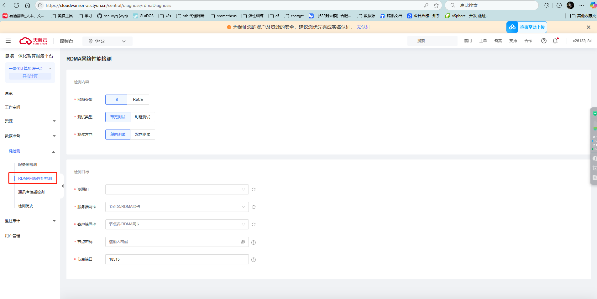
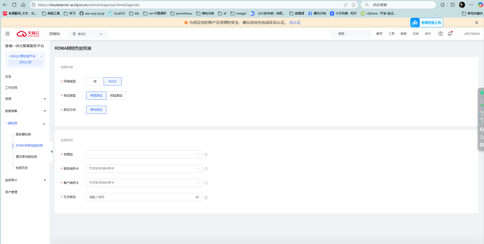
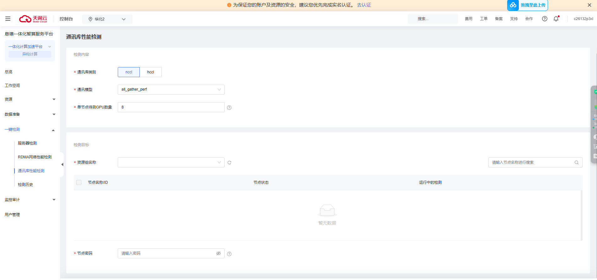
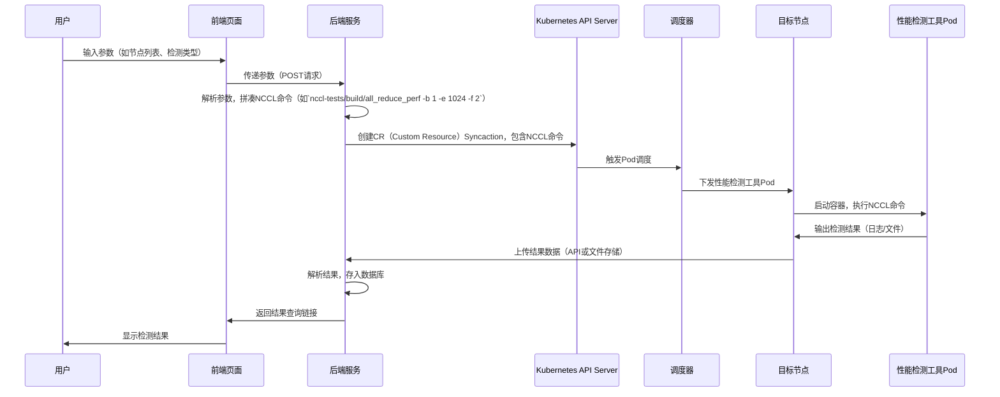
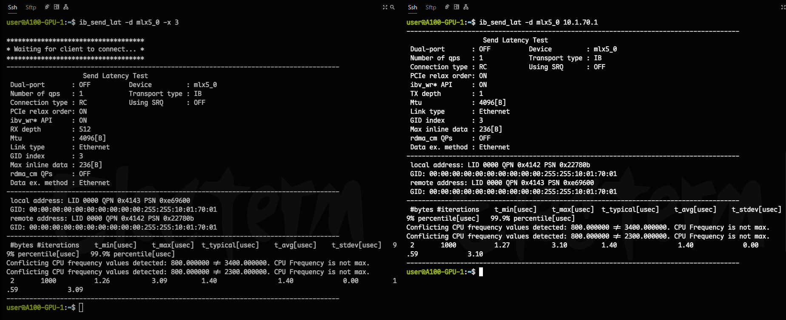

# 一键通信检测方案

## 问题背景

方便快捷的发现训练节点的网络通信和通信性能问题。

待解决问题：
1.  通信库性能检测
2.  rama 网络性能检测
3.  保存历史检测数据

## 竞品分析

天翼云

RDMA网络性能检测：




通讯库性能检测：




## 解决方案


### RDMA网络性能检测

需要传入的参数：
1.  测试的节点列表，
2.  网卡设备名称，
3.  物理端口，
4.  操作类型（read/write/send），

**整体流程如下：**

通过页面参数传递到 syncaction CR 中，根据参数拼凑完整的rdma 带宽检测命令。然后通过调度器将性能检测工具pod下发到对应的节点上执行。最后保存检测结果。


### 通信库性能测试

需要传入的参数（也可以根据资源池来进行测试，测试整个资源池下计算节点之间所有计算资源的通信性能）： 
1. 测试的节点列表，
2. 通信算子类型(all_reduce,all_gather,brodcast等)，
3. 节点参与通信的卡的数量，


**整体流程如下：**

通过页面参数传递到 syncaction CR 中，根据参数拼凑完整的nccl 通信检测命令。然后通过调度器将性能检测工具pod下发到对应的节点上执行。最后保存检测结果。





## 方案验证


### nccl 通信库测试


使用volcano job 来进行功能验证：

镜像：registry.cnbita.com:5000/cluster-images/nccl-tests:v2.13-cuda12.2

```bash
2机2卡

mpirun -np 2 -H trainingjob-m123456-m1-0.trainingjob-m123456,trainingjob-m123456-m2-0.trainingjob-m123456 --allow-run-as-root  --output-filename log_output --merge-stderr-to-stdout ./all_reduce_perf -b 32M -e 512M  -f 2 -g 2


mpirun -np 2 -H 10.1.30.41,10.1.30.42  --allow-run-as-root -bind-to none -map-by slot -mca coll_hcoll_enable 0 -mca pml ob1 -mca btl_tcp_if_include  bond0 -mca btl ^openib -x NCCL_IB_GID_INDEX=3 -x NCCL_SOCKET_IFNAME=bond0  -x NCCL_IB_HCA=^mlx5_8 -x NCCL_IB_TC=128 -x NCCL_IB_QPS_PER_CONNECTION=8 -x NCCL_DEBUG=INFO -x NCCL_ALGO=Ring /data/wangshi/nccl-tests-2.13.11/build/all_reduce_perf -b 32M -e 8G  -f 2 -g 8


```
验证结果如下：


### hccl 通信库测试

单机场景

```bash
./bin/all_reduce_test -p 8 -b 8K -e 64M -f 2 -d fp32 -o sum
```

多机场景
```bash
mpirun -f hostfile -n 16 ./bin/all_reduce_test -p 8 -b 8K -e 64M -f 2 -d fp32 -o sum

```


### 计算节点间网卡带宽测试

查看存在的ib&roce网卡

```bash
ibdev2netdev
```


```bash
服务端
ib_write_bw -d mlx5_0 -x 3  


客户端
ib_write_bw -d mlx5_0 10.1.70.1 --report_gbits 

```

验证结果如下：


### 时延测试

```bash

服务端
ib_send_lat -d mlx5_0 -x 3

客户端
ib_send_lat -d mlx5_0 10.1.70.1  
```



## 波及分析

不影响当前类脑云其它服务。

## 评审结果

#TODO

## 参考文档

[hccl 通信库测试教程](https://www.hiascend.com/document/detail/zh/canncommercial/80RC1/devaids/auxiliarydevtool/HCCLpertest_16_0003.html)
[天翼云通信检测地址](https://cloudwarrior-ai.ctyun.cn/central/diagnose/cclDiagnosis)


```bash
#!/bin/bash

# ===============================================
# Script: rdma_test.sh
# Author: 小锋学长
# Description:
#   一键运行 RDMA 带宽测试（ib_write_bw）工具，自动完成：
#     - 自动检测 GID index
#     - 切换 CPU governor 为 performance
#     - 支持 server/client 模式
#     - 支持 read / write / send 操作类型（默认 read）
#     - 支持传入设备名、端口号
#     - 测试后自动恢复 CPU governor
#
# Requirements:
#   - ib_write_bw 工具（来自 perftest 包）
#   - Mellanox 驱动已正确加载
#   - RDMA 设备支持 RoCE 并已配置 IP + GID
#
# Usage:
#   Server 模式：
#     bash rdma_test.sh server
#     bash rdma_test.sh server [device] [port] [mode_type]
#
#   Client 模式：
#     bash rdma_test.sh client <server_ip>
#     bash rdma_test.sh client <server_ip> [device] [port] [mode_type]
#
# Examples:
#   bash rdma_test.sh server mlx5_1 1 read
#   bash rdma_test.sh client 192.168.5.228 mlx5_1 1 read
#
# Note:
#   - 默认设备为 mlx5_1，默认物理端口为 1
#   - GID index 会根据本地 IP 自动选择
#   - 支持异常退出自动清理 CPU governor 设置
# ===============================================

# CONFIGURATION (默认值)
MODE=""           # 第一个参数为运行模式，server 或 client
PEER_IP=""        # 第二个参数作为 Server IP（仅 client 模式使用）
DEVICE="mlx5_1"   # 第三个参数为设备名，默认值为 mlx5_1
PORT=1            # 第四个参数为物理端口，默认 1
MODE_TYPE="read"  # 第五个参数为传输模式，read/write/send（默认 read）
GID_INDEX=-1      # 自动检测

# 解析参数
ARGS=$(getopt -o m:i:d:p:t: \
  -l mode:,peer_ip:,device:,port:,mode_type: \
  -n "$0" -- "$@")
if [ $? -ne 0 ]; then
  echo "❌ 参数解析失败"
  exit 1
fi
eval set -- "$ARGS"
while true; do
  case "$1" in
    -m|--mode) MODE="$2"; shift 2 ;;
    -i|--peer_ip) PEER_IP="$2"; shift 2 ;;
    -d|--device) DEVICE="$2"; shift 2 ;;
    -p|--port) PORT="$2"; shift 2 ;;
    -t|--mode_type) MODE_TYPE="$2"; shift 2 ;;
    --) shift; break ;;
    *) echo "❌ 未知参数: $1" >&2; exit 1 ;;
  esac
done


# 确定实际运行的测试工具
case "$MODE_TYPE" in
  write) TEST_TOOL="ib_write_bw" ;;
  send)  TEST_TOOL="ib_send_bw" ;;
  *)     TEST_TOOL="ib_read_bw" ;;
esac
echo "==== RDMA 快速检查和测试工具 ===="
echo "运行模式   : $MODE"
echo "操作类型   : $TEST_TOOL"
echo "网卡设备   : $DEVICE"
echo "物理端口   : $PORT"
[[ "$MODE" == "client" ]] && echo "目标Server: $PEER_IP"


# === 1. 检查 Mellanox 驱动加载状态 ===
echo "[1] 检查驱动模块加载状态"
lsmod | grep mlx5 || echo "❌ 未加载 Mellanox 驱动模块"


# === 2. 查看设备状态 ===
echo -e "\n[2] 查看设备列表与状态"
ibv_devinfo -d "$DEVICE" || { echo "❌ RDMA 设备不可用"; exit 1; }


# === 3. 自动识别 GID index ===
echo -e "\n[3] 显示端口 $PORT 的 GID 表："
for i in {0..15}; do
  GID=$(cat /sys/class/infiniband/${DEVICE}/ports/${PORT}/gids/$i)
  echo "GID[$i] = $GID"
  if [[ "$GID" =~ .*c0a8.* ]]; then  # 检查是否含有192.168.5.x对应十六进制段
    GID_INDEX=$i
  fi
done
if [[ "$GID_INDEX" -eq "-1" ]]; then
  echo "❌ 未能自动识别出 GID index，请手动设置 GID_INDEX"
  exit 1
else
  echo "✅ 使用 GID index: $GID_INDEX"
fi


# === 3.5 临时将 CPU governor 切换为 performance，并注册恢复 ===
echo -e "\n[3.5] 临时切换 CPU governor 为 performance"
declare -A ORIGINAL_GOVERNORS
for cpu in /sys/devices/system/cpu/cpu[0-9]*; do
  gov_file="$cpu/cpufreq/scaling_governor"
  cpu_name=$(basename "$cpu")
  ORIGINAL_GOVERNORS[$cpu_name]=$(cat "$gov_file")
  echo performance | sudo tee "$gov_file" > /dev/null
done
sleep 1

restore_governors() {
  echo -e "\n[清理] 恢复原有 CPU governor 设置..."
  for cpu in "${!ORIGINAL_GOVERNORS[@]}"; do
    echo "${ORIGINAL_GOVERNORS[$cpu]}" | sudo tee /sys/devices/system/cpu/$cpu/cpufreq/scaling_governor > /dev/null
  done
}
trap restore_governors EXIT


# === 4. 启动 RDMA 测试 ===
echo -e "\n[4] 启动 ib_write_bw 测试"
COMMON_ARGS="-d $DEVICE -i $PORT -x $GID_INDEX -s 65536 -q 8 -n 500000 --noPeak --report_gbits"

if [[ "$MODE" == "server" ]]; then
  echo "🟢 正在启动 server（设备=$DEVICE, 端口=$PORT, GID=$GID_INDEX, 模式=$TEST_TOOL）"
  # send 模式提示 + 参数处理
  if [[ "$MODE_TYPE" == "send" ]]; then
    echo -e "\n📢 注意：当前为 send 模式，client需要主动发送数据"
    if [[ "$MODE" == "server" ]]; then
      COMMON_ARGS="$COMMON_ARGS --run_infinitely"
    fi
  fi
  echo "🔧 实际执行命令：sudo $TEST_TOOL $COMMON_ARGS"
  while true; do
    echo -e "\n🟢 等待 client 连接..."
    sudo $TEST_TOOL $COMMON_ARGS
    echo -e "\n✅ 当前 client 测试完成，等待下一个连接...\n"
    sleep 1
  done
elif [[ "$MODE" == "client" ]]; then
  if [[ -z "$PEER_IP" ]]; then
    echo "❌ 错误：client 模式需要指定 server IP"
    echo "用法：$0 client <server_ip> [device] [port] [mode_type]"
    exit 1
  fi
  echo "🚀 正在连接到 server $PEER_IP（设备=$DEVICE, 端口=$PORT, GID=$GID_INDEX, 模式=$TEST_TOOL）"
  echo "🔧 实际执行命令：sudo $TEST_TOOL $COMMON_ARGS $PEER_IP"
  sudo $TEST_TOOL $COMMON_ARGS "$PEER_IP"
else
  echo "❌ 错误：必须指定模式参数 server 或 client"
  echo "用法：$0 server [device] [port] [mode_type] 或 $0 client <server_ip> [device] [port] [mode_type]"
  exit 1
fi
```
服务端
bash rdma_test.sh -m server -t read

客户端
bash test_rdma.sh -m client -i 192.168.5.228 -d mlx5_1 -p 1 -t read 


部署命令：
git clone -b test https://gitlab.bitahub.com/hero-os/herokey.git
cd herokey/installpkg/single/monitor/kube-prometheus
bash install.sh ./

注意事项：

1. 因当前版本的Prometheus部署需要对应的StorageClass存在,当前默认使用的SC是csi-s3，所以需要清理旧版本Prometheus的pv和pvc，服务才能正常更新升级。


linux 配置服务代理

```bash
export http_proxy=http://192.168.13.25:7890
export https_proxy=http://192.168.13.25:7890
```

docker 配置代理

```bash
vi /usr/lib/systemd/system/docker.service


[Service]
...
# proxy
Environment="HTTP_PROXY=http://192.168.13.25:7890"
Environment="HTTPS_PROXY=http://192.168.13.25:7890"
Environment="NO_PROXY=localhost,127.0.0.1,172.17.*.*,10.0.*.*,registry.hub.com,registry.cnbita.com"


docker daemon-reload
systemctl restart docker

```