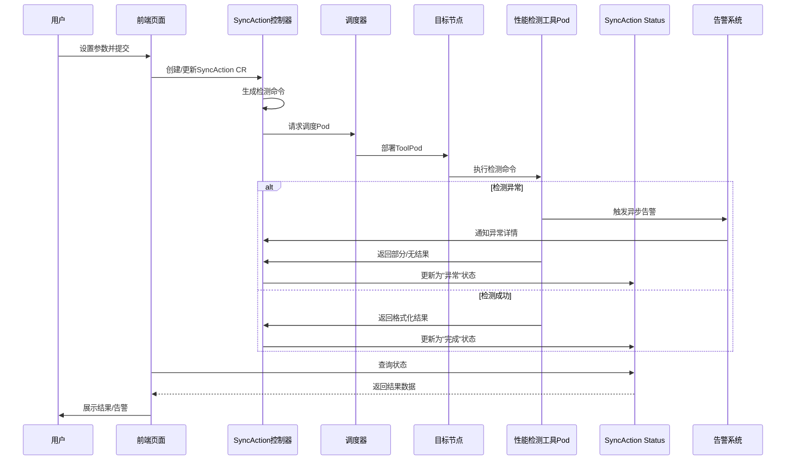

# 集群故障检测和恢复方案

## 性能检测

| 检测项                     | 检测方法                                                                              | 风险等级 |
| -------------------------- | ------------------------------------------------------------------------------------- | -------- |
| 通信库算子性能检测         | 使用 nccl-test 测试 NCCL 通信性能，输出带宽指标，验证多 GPU 协同效率。                | 高       |
| Roce/IB 通信带宽和时延检测 | 用 ib_write_bw/ib_read_bw 测带宽，ib_write_lat/ib_read_lat 测时延，验证网络传输效率。 | 高       |
| CPU 性能检测               | stress-ng 压测满载性能                                                                | 中       |
| 内存性能检测               | mbw 测带宽                                                                            | 中       |
| 磁盘 io 性能检测           | fio 模拟随机 / 顺序读写压测                                                           | 中       |
| 模型训练性能检测           | 文本/图像/视频 （mfu、time-to-train指标）                                             | 中       |

### GPU 故障检测

| 检测项                      | 检测方法                                                                   | 解决方法                                                                                                                                                                          | 风险等级              |
| --------------------------- | -------------------------------------------------------------------------- | --------------------------------------------------------------------------------------------------------------------------------------------------------------------------------- | --------------------- |
| GPU ECC Errors              | nvidia-smi -q -d ECC 查 “Correctable Errors”，识别可纠正内存错误。         | **异常处理**：执行 nvidia-smi --reset-gpu 重启驱动，或 nvidia-smi -pm 1 启用持久模式降低错误；**人工兜底**：长期高错误时，停机检查 GPU 内存模块，必要时更换 GPU。                 | 低（可自动纠错）      |
| GPU Uncorrectable Errors    | nvidia-smi -q -d ECC 查 “Uncorrectable Errors”，识别不可恢复内存故障。     | **异常处理**：自动禁止调度 → 排干节点 Pod → 重启节点（触发热插拔扫描）；**人工兜底**：更换故障 GPU 卡，重新纳管节点并验证 ECC 状态。                                              | 高（直接中断训练）    |
| GPU 掉卡检测                | nvidia-smi -L 列出现有 GPU，对比基线数量，识别掉卡。                       | **异常处理**：自动禁止调度 → 排干节点 Pod → 重启节点（触发热插拔扫描）；**人工兜底**：检查 GPU 物理插槽、供电，重新插拔卡，更新驱动 / 固件后验证。                                | 高（训练任务失败）    |
| NVLink P2P状态检测          | nvidia-smi nvlink -s 查 NVLink 连接状态、带宽，识别链路异常。              | **异常处理**：自动禁止调度 → 重启节点；**人工兜底**：检查 NVLink 桥接器物理连接，更新 GPU 驱动 / 固件，必要时更换硬件。                                                           | 高（多 GPU 通信中断） |
| nvidia-peermem 模块加载检测 | lsmod grep nvidia_peermem 检查模块是否加载，缺失则影响 P2P 内存访问。      | **异常处理**：自动执行 modprobe nvidia_peermem 加载模块，写入 /etc/modules-load.d/ 确保开机自启；**人工兜底**：更新 GPU 驱动，验证模块加载状态。                                  | 中（影响内存性能）    |
| FabricManager 服务检测      | systemctl status nvidia-fabricmanager 查服务状态，异常则影响 NVLink 通信。 | **异常处理**：自动执行 systemctl restart nvidia-fabricmanager 重启服务；**人工兜底**：检查日志 /var/log/nvidia-fabricmanager/，升级 DCGM 或更换故障组件。                         | 中（多 GPU 协同异常） |
| GPU XID 错误检测            | dmesg -T grep Xid 查 XID 错误                                              | 针对 XID 48、62、64、74、79、95、109、122、123、124的结果。  **异常处理**：自动禁止调度 → 排干节点 Pod → 重启节点；**人工兜底**：检查 GPU 卡状态，必要时更换卡并更新驱动 / 固件。 | 高（训练任务失败）    |
| GPU其他故障                 | 温度过高、功耗异常、风扇故障等                                             | **异常处理**：自动禁止调度 → 排干节点 Pod → 重启节点；**人工兜底**：检查 GPU 卡状态，必要时更换卡并更新驱动 / 固件。                                                              | 高（训练任务失败）    |

## RDMA 故障检测

| 检测项       | 检测方法                                                            | 解决方法                                                                                                                                    | 风险等级           |
| ------------ | ------------------------------------------------------------------- | ------------------------------------------------------------------------------------------------------------------------------------------- | ------------------ |
| 网卡掉卡检测 | ibdev2netdev 映射 IB/RoCE 设备，对比基线识别掉卡。                  | **异常处理**：自动禁止调度 → 排干节点 → 重启节点；**人工兜底**：检查网卡供电、物理接口，更新驱动 / 固件，必要时更换网卡。                   | 高（网络通信中断） |
| 网卡状态检测 | ip link show 查网卡状态（UP/DOWN），ibdev2netdev 检查 IB 网卡状态。 | **异常处理**：自动执行 ip link set [网卡名] down && up 软重启网卡；**人工兜底**：硬重启（更换网卡），检查交换机端口、线缆，验证网络连通性。 | 高（网络中断）     |

**存储故障检测**

| 检测项     | 检测方法                                                                     | 解决方法                                                                                                                              | 风险等级           |
| ---------- | ---------------------------------------------------------------------------- | ------------------------------------------------------------------------------------------------------------------------------------- | ------------------ |

| 磁盘只读   | 对挂载点执行写操作（如 touch /data/testfile），失败则判定只读。              | **自愈**：自动尝试 mount -o remount,rw [分区] 重新挂载；**人工兜底**：检查磁盘 SMART（smartctl -a [磁盘]），更换故障磁盘并恢复数据。  | 高（数据无法写入） |
| 挂载点异常 | cd [挂载点] 或 ls [挂载点] 测试访问，卡顿时判定异常（如 NFS 网络挂载超时）。 | **自愈**：自动执行 umount -l [挂载点] 强制卸载；**人工兜底**：检查 NFS 服务器 / 网络，调整 /etc/fstab（如加 _netdev），重新挂载验证。 | 高（进程卡死）     |
| 磁盘卡IO   | ps aux grep D找 D 状态进程（等待磁盘无响应），结合iostat -xmt 。             | **自愈**：自动触发 echo 1 > /proc/sysrq-trigger 内核检测，重启节点；**人工兜底**：更换故障磁盘，调整存储阵列配置（如 RAID 重建）。    | 高（系统无响应） |

故障应对策略：

| 故障应对策略 | 效果                                                              |
| ------------ | ----------------------------------------------------------------- |
| 提示异常     | 上报Kubernetes事件。                                              |
| 禁止调度     | 上报Kubernetes事件，并为节点添加NoSchedule污点。                  |
| 驱逐节点负载 | 上报Kubernetes事件，并为节点添加NoExecute污点，驱逐节点上的负载。 |
| 节点重启     | 上报Kubernetes事件，重启节点。                                    |
| 重新检测     | 上报Kubernetes事件，解除节点封锁。                                |

故障恢复事件记录：

| 事件描述         | 事件类别 |
| ---------------- | -------- |
| 开启自动故障处理 | Normal   |
| 自动故障处理     | Warning  |
| 自动故障处理失败 | Warning  |
| 自动故障处理成功 | Normal   |

## 问题背景

在深度学习领域，分布式训练已成为处理大规模数据集和复杂模型的关键技术。然而，分布式系统的复杂性使得训练过程中容易出现各类故障，如节点内硬件连接异常、节点间通信中断、存储挂载失效以及 GPU 和网卡故障等。为保障分布式训练任务的稳定性和可靠性，本方案针对节点内 NVLink 检查、节点间 RoCE/IB 通信检查、存储挂载检查、GPU ECC Error 检查与重置、GPU 掉卡、网卡掉卡等新特性，提出全面的诊断与容错技术方案。

待解决问题：

1. 提供基于集群,资源池,节点和任务级别做故障检测和恢复的能力。
2. 提供 ib/roce 性能测试能力。

## 竞品分析

天翼云

### RDMA网络性能检测


### 通讯库性能检测


## 服务器检测


### 检测历史


阿里云
<https://help.aliyun.com/zh/ack/ack-managed-and-ack-dedicated/user-guide/work-with-cluster-diagnostics/>

腾讯云
<https://cloud.tencent.com/document/product/1646/107749>

华为云
<https://support.huaweicloud.com/usermanual-cce/cce_10_0659.html>

百度云
<https://cloud.baidu.com/doc/AIHC/s/Slqvte8b5>

## 解决方案

### 应用场景

- 集群创建完成后，执行整体的一个环境检测，辅助进行异常修复。（硬件，软件，特定需求）。
- 周期巡查，出现问题的节点并进行隔离。
- 根据基准节点做对比测试，（增加新的节点和一致性需求）。
- 根据任务申请的资源做健康检测，保证训练的稳定性。

### 实现流程

检测范围：**集群、资源池、节点**
查询周期：**一次执行、循环执行**

通过CR实现：

1. 通过页面参数传递到 syncaction CR 中，根据参数拼凑完整的检测命令。
2. 通过调度器将性能检测工具pod下发到对应的目标节点上执行。
3. 检验过程中，出现无法自动恢复的异常，执行告警逻辑(发送告警到alertmanager).
4. 解析格式化检测结果后写入status。
5. 页面通过查询CR 的status来展示结果。



CR 实例如下：
(具体cr字段根据实现流程中进行调整)

```bash
apiVersion: system.hero.ai/v1alpha1
kind: SyncAction
metadata:
  name: syncaction-sample
spec:
  name: HealthCheckAction
  HealthCheckSpec: 
    checkItems: ["RDMA","GPU"]     # 检测类型
    scope: "cluster"               # 检测范围
    recover: true                  # 是否尝试自动恢复
    cycle: "1h"                    # 检测周期
    typeParameter：                # 检测参数
      serverNode: "node_1"
      serverDeviceName : mlx5_1
      clientNode: "node_2"
      clientDeviceName : mlx5_1  

status: 
  checkResult:                     # 查询结果
    satrtTime:,                    # 检测开始时间
    endTime:,                      # 检测结束时间
    nodes: ["",""],                # 检测节点
    reslut: [
        {
            type: "RDMA",         # 检测类型
            result: "success",    # 检测状态 
            message: {检测结果},   # 检测结果
        },
        {
            type: "GPU", 
            result: "fail",
            message: {检测结果},
        }
    ]
```

CR 运行状态: **"Failed","Succeed","Syncing""**

> 注：NVIDIA_VISIBLE_DEVICES 这个环境变量设置默认禁用的场景是在trainjob和notebook 中。对syncaction 不存在影响。

### 自动修复

**使用场景**： 在检测出指标异常或者失败的场景下，执行对应脚本，进行性能优化和恢复。

**实现方式**：通过针对每个检测项，制作对应的shell脚本文件。通过ssh的方式在对应节点执行命令。

示例：服务器重启。

```bash
#!/bin/bash

REMOTE_IP=$1
REMOTE_USER=$2
REMOTE_PORT=$3
execute_remote() {
    ssh ${REMOTE_USER}@${REMOTE_IP} -p ${REMOTE_PORT} "$@"
}

# Reboot the machine
echo "Rebooting ${REMOTE_IP}..."
execute_remote "sudo reboot -h now"

# Wait for machine to reboot
while true; do
    if execute_remote "exit"; then
        break
    fi
    sleep 10  # Wait for 10 seconds before trying again
done
```

### 告警配置

**使用场景**： 在性能检测失败的情况下，配置告警通知管理员。

**实现方式**： 将错误信息发送到alertmanager后，应用测处理转发。

请求方式：POST
请求地址：/api/v2/alerts
请求示例：请求内容是一个数组，里面是多个的告警内容。其中只有labels是必填参数，其他都是可选。时间参数默认值为当前时间的整时，如果传参时间格式必须是标准UTC时间。

请求示例：

```bash
[
    {
        "startsAt": "2023-07-07T07:07:07.00Z",
        "labels": {
            "alertname": "NodeStatusDown",
            "job": "node-exporter",
            "severity": "warning",
            "team": "server"
        },
        "annotations": {
            "description": "192.168.10.2 host down more than 5 minutes",
            "summary": "node status down",
            "value": "192.168.10.2"
        }
    }
]

curl -X POST -H 'content-type:application/json' -d '[{"startsAt":"2023-07-07T07:07:07.00Z","labels":{"alertname":"NodeStatusDown","job":"node-exporter","severity":"warning","team":"server"},"annotations":{"description":"192.168.10.2 host down more than 5 minutes","summary":"node status down","value":"192.168.10.2"}}]' 127.0.0.1:9093/api/v2/alerts
```

验证结果：


## 方案验证

### 检测项和容错

#### 节点存储点挂载检测

检测方法：

```bash
df -h 

Filesystem                         Size  Used Avail Use% Mounted on
tmpfs                              101G  8.4M  101G   1% /run
/dev/mapper/ubuntu--vg-ubuntu--lv  444G  200G  244G  46% /
tmpfs                              504G  962M  503G   1% /dev/shm
tmpfs                              5.0M     0  5.0M   0% /run/lock
/dev/sda2                          2.0G  404M  1.4G  23% /boot
/dev/sda1                          1.1G  6.1M  1.1G   1% /boot/efi
tmpfs                              101G  4.0K  101G   1% /run/user/22126
tmpfs                              101G  4.0K  101G   1% /run/user/22327
/9920_DPC_Test                      80T   38T   43T  47% /data
/dev/nvme0n1p1                     3.5T  3.3T  283G  93% /data0
tmpfs                              101G  4.0K  101G   1% /run/user/1000
```

恢复方法：nil

检测结果:  PASS/FAIL

#### RoCE/IB 接口状态检测

检测方法：

```bash
ibdev2netdev  # 显示IB设备与网络设备映射关系和网卡状态

mlx5_0 port 1 ==> enp46s0np0 (Up)
mlx5_1 port 1 ==> enp49s0np0 (Up)
mlx5_2 port 1 ==> enp94s0np0 (Up)
mlx5_3 port 1 ==> enp95s0np0 (Up)
mlx5_4 port 1 ==> ens97np0 (Up)
mlx5_5 port 1 ==> enp165s0np0 (Up)
mlx5_6 port 1 ==> enp168s0np0 (Up)
mlx5_7 port 1 ==> enp206s0np0 (Up)
mlx5_8 port 1 ==> enp209s0np0 (Up)

show_gids

DEV     PORT    INDEX   GID                                     IPv4            VER     DEV
---     ----    -----   ---                                     ------------    ---     ---
mlx5_0  1       0       fe80:0000:0000:0000:eaeb:d3ff:fedf:3e0e                 v1      enp46s0np0
mlx5_0  1       1       fe80:0000:0000:0000:eaeb:d3ff:fedf:3e0e                 v2      enp46s0np0
mlx5_0  1       2       0000:0000:0000:0000:0000:ffff:0a01:4601 10.1.70.1       v1      enp46s0np0
mlx5_0  1       3       0000:0000:0000:0000:0000:ffff:0a01:4601 10.1.70.1       v2      enp46s0np0
```

异常状态展示如下：

```bash
[root@system-test-100-16-gpu-3090 ~]# ibdev2netdev
mlx5_0 port 1 ==> ibp83s0f0 (Down)
mlx5_1 port 1 ==> ibp83s0f1 (Down)
```

恢复方法：nil

检测结果:  PASS/FAIL

#### NVLink 状态检测

检测方法：

```bash
vidia-smi nvlink -s

GPU 0: NVIDIA A100-SXM4-80GB (UUID: GPU-08f3d78c-db20-d6b5-43ac-d4c51f52b61d)
         Link 0: 25 GB/s
         Link 1: 25 GB/s
         Link 2: 25 GB/s
         Link 3: 25 GB/s
         Link 4: 25 GB/s
         Link 5: 25 GB/s
         Link 6: 25 GB/s
         Link 7: 25 GB/s
         Link 8: 25 GB/s
         Link 9: 25 GB/s
         Link 10: 25 GB/s
         Link 11: 25 GB/s
GPU 1: NVIDIA A100-SXM4-80GB (UUID: GPU-5c43d80e-c8c4-fe93-63de-fe26181f6c76)
         Link 0: 25 GB/s
         Link 1: 25 GB/s
         Link 2: 25 GB/s
         Link 3: 25 GB/s
         Link 4: 25 GB/s
         Link 5: 25 GB/s
         Link 6: 25 GB/s
         Link 7: 25 GB/s
         Link 8: 25 GB/s
         Link 9: 25 GB/s
         Link 10: 25 GB/s
         Link 11: 25 GB/s
...

```

恢复方法：nil

检测结果:  PASS/FAIL

#### GPU ECC 错误检测

检测方法：

```bash
nvidia-smi -q -d ECC
Timestamp                                 : Thu Jun  5 16:13:28 2025
Driver Version                            : 560.35.05
CUDA Version                              : 12.6

Attached GPUs                             : 8
GPU 00000000:27:00.0
    ECC Mode
        Current                           : Enabled
        Pending                           : Enabled
    ECC Errors
        Volatile
            SRAM Correctable              : 0
            SRAM Uncorrectable Parity     : 0
            SRAM Uncorrectable SEC-DED    : 0
            DRAM Correctable              : 0
            DRAM Uncorrectable            : 0
        Aggregate
            SRAM Correctable              : 0
            SRAM Uncorrectable Parity     : 0
            SRAM Uncorrectable SEC-DED    : 0
            DRAM Correctable              : 0
            DRAM Uncorrectable            : 0
            SRAM Threshold Exceeded       : No
        Aggregate Uncorrectable SRAM Sources
            SRAM L2                       : 0
            SRAM SM                       : 0
            SRAM Microcontroller          : 0
            SRAM PCIE                     : 0
            SRAM Other                    : 0

GPU 00000000:2A:00.0
    ECC Mode
        Current                           : Enabled
        Pending                           : Enabled
    ECC Errors
        Volatile
            SRAM Correctable              : 0
            SRAM Uncorrectable Parity     : 0
            SRAM Uncorrectable SEC-DED    : 0
            DRAM Correctable              : 0
            DRAM Uncorrectable            : 0
        Aggregate
            SRAM Correctable              : 0
            SRAM Uncorrectable Parity     : 0
            SRAM Uncorrectable SEC-DED    : 0
            DRAM Correctable              : 0
            DRAM Uncorrectable            : 0
            SRAM Threshold Exceeded       : No
        Aggregate Uncorrectable SRAM Sources
            SRAM L2                       : 0
            SRAM SM                       : 0
            SRAM Microcontroller          : 0
            SRAM PCIE                     : 0
            SRAM Other                    : 0

...

```

恢复方法：nil
检测结果:  PASS/FAIL

#### GPU 掉卡检测

检测方法：

```bash
nvidia-smi  -L
GPU 0: NVIDIA A100-SXM4-80GB (UUID: GPU-08f3d78c-db20-d6b5-43ac-d4c51f52b61d)
GPU 1: NVIDIA A100-SXM4-80GB (UUID: GPU-5c43d80e-c8c4-fe93-63de-fe26181f6c76)
GPU 2: NVIDIA A100-SXM4-80GB (UUID: GPU-2e260918-c0a5-81c8-9308-5a1b59ec355e)
GPU 3: NVIDIA A100-SXM4-80GB (UUID: GPU-f145927a-45b4-527c-f4dd-99e3d7ecd605)
GPU 4: NVIDIA A100-SXM4-80GB (UUID: GPU-c49f0000-9c2e-b78e-8d28-2ca53b3447f4)
GPU 5: NVIDIA A100-SXM4-80GB (UUID: GPU-5b8d90df-9a49-4bcb-8fb0-96afada9d368)
GPU 6: NVIDIA A100-SXM4-80GB (UUID: GPU-f541f4b1-4e27-396d-a251-09f696152bb9)
GPU 7: NVIDIA A100-SXM4-80GB (UUID: GPU-7c473709-eb14-858d-3e76-5220fc8aa522)

nvidia-smi  -L  |  wc -l
8
```

或者 `dmesg -T |grep Xid` 结果中包含Xid 79,则存在掉卡故障。


恢复方法：更换硬件或者重启GPU

检测结果: PASS/FAIL

#### GPU 链路故障

检测方法：

`dmesg -T |grep Xid` 结果中包含Xid 74，如下图，则存在GPU链路故障。


#### 网卡掉卡检测

检测方法：

```bash
ip link show  | grep 'state DOWN'
16: docker0: <NO-CARRIER,BROADCAST,MULTICAST,UP> mtu 1500 qdisc noqueue state DOWN mode DEFAULT group default
```

恢复方法：重启网卡或者更换网卡

检测结果: PASS/FAIL

#### nvidia-peermem 模块检测

检测方法：

```bash
lsmod | grep nvidia_peermem

nvidia_peermem         16384  0
nvidia               9625600  321 nvidia_uvm,nvidia_peermem,nvidia_modeset
ib_core               430080  9 rdma_cm,ib_ipoib,nvidia_peermem,iw_cm,ib_umad,rdma_ucm,ib_uverbs,mlx5_ib,ib_cm

```

恢复方法：

```bash
modprobe nvidia_peermem
```

检测结果: PASS/FAIL

#### fabricmanager服务状态检测

检测方法：

```bash
systemctl status nvidia-fabricmanager
```

检查结果，fabricmanager未启动为异常状态，下图为正常状态。


### 性能测试

镜像构建: [参考文档](./Dockerfile)
镜像环境验证: **mlx5_0 设备需要正常关联到net1 网卡接口。**

通过镜像容器验证结果如下：


#### nccl 通信库测试

使用volcano job 来进行功能验证：[ssh.yaml](./ssh.yaml)

验证命令如下：

```bash
2机2卡

mpirun -np 2 -H trainingjob-m123456-m1-0.trainingjob-m123456,trainingjob-m123456-m2-0.trainingjob-m123456 \
--allow-run-as-root  \
--output-filename log_output \
--merge-stderr-to-stdout \
--mca mpi_debug 1 \
-x NCCL_IB_GID_INDEX=3 \
-x NCCL_DEBUG=INFO \
-x NCCL_IB_HCA=mlx5_0 \
./all_reduce_perf -b 512M -e 16G  -f 2 -g 2 

```

验证结果如下：


> 注: #wrong 为 0 可以验证gpu 计算的正确性.

查看网卡绑定的网络接口

```bash
ibdev2netdev 

mlx5_0 port 1 ==> ibp83s0f0 (Down)
mlx5_1 port 1 ==> ibp83s0f1 (Down)
```

#### 网卡带宽测试

roce 通信过程中，存在控制链路通信和数据链路通信，只有两者都能正常的情况下，通信带宽测试才能正常运行。控制链路主要是交换通信双方的一些信息。

客户端测试命令中的ip可以指定控制链路的ip，也可以指定数据链路的ip。

如果指定ip为 172.200.162.199 ，那么也需要在另一个节点ping通。

验证命令如下：

```bash
服务端
ib_write_bw -d mlx5_0 -x 7 


客户端
ib_write_bw -d mlx5_0 10.1.111.2 --report_gbits  -x 7 

./ib_write_bw --use_cuda=4  -d mlx5_5 -x 3
./ib_write_bw --use_cuda=5 -d mlx5_4 10.1.30.43 --report_gbits  -x 3

```

验证结果如下：


> 注： 服务端和客户端命令中的-x 参数需要根据参数show_gids命令进行指定。10.1.111.2 和10.1.111.3 是两个通信节点roce设备绑定的网卡接口，必须可以ping通。数据链路通信会走该IP。


#### 网卡时延测试

验证命令如下：

```bash

服务端
ib_send_lat -d mlx5_0 -x 7

客户端
ib_send_lat -d mlx5_0 10.1.111.2 --report_gbits  -x 7
```

验证结果如下：


## 波及分析

任务级别的调整,会涉及训练容错部分的功能.但不影响该部分功能.

## 评审结果

# TODO

增加表格展示检测项，方便其它人员观看

细化检查项（增加有意义的检测项）

ps -eo pid,stat,cmd 查看进程的状态

## 参考文档

[hccl 通信库测试教程](https://www.hiascend.com/document/detail/zh/canncommercial/80RC1/devaids/auxiliarydevtool/HCCLpertest_16_0003.html)
[天翼云通信检测地址](https://cloudwarrior-ai.ctyun.cn/central/diagnose/cclDiagnosis)
[天翼云通信检测文档](https://www.ctyun.cn/document/10303243/10796359)
[阿里云k8s集群集群诊断](https://help.aliyun.com/zh/ack/ack-managed-and-ack-dedicated/user-guide/work-with-cluster-diagnostics/)
[腾讯云高性能计算集群自助检测](https://cloud.tencent.com/document/product/1646/107749)
[华为云节点故障检测策略](https://support.huaweicloud.com/usermanual-cce/cce_10_0659.html)
[GPU降频](https://zhuanlan.zhihu.com/p/13866293937)
[阿里云节点异常检测](https://help.aliyun.com/zh/ack/ack-managed-and-ack-dedicated/user-guide/node-troubleshooting?spm=a2c4g.11186623.help-menu-85222.d_2_1_7.6f1e1852B6hxIB&scm=20140722.H_427083._.OR_help-T_cn~zh-V_1)
[火山云故障检测方案](https://developer.volcengine.com/articles/7337207780530454538)
[百度云故障检测方案](https://cloud.baidu.com/doc/CCE/s/mm24chqb4)
[百度云自动故障隔离功能](https://cloud.baidu.com/doc/AIHC/s/Slqvte8b5)
