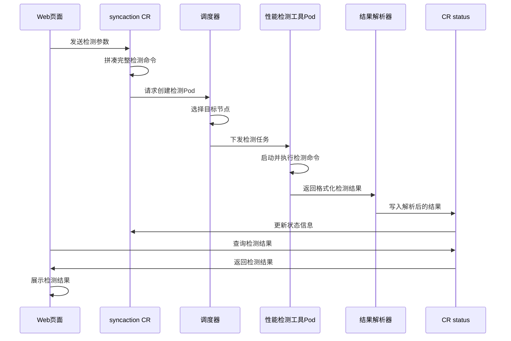

# 通信性能检测方案

性能检测：

| 检测项                     | 检测方法                                                                              | 风险等级 |
| -------------------------- | ------------------------------------------------------------------------------------- | -------- |
| 通信库算子性能检测         | 使用 nccl-test 测试 NCCL 通信性能，输出带宽指标，验证多 GPU 协同效率。                | 高       |
| Roce/IB 通信带宽和时延检测 | 用 ib_write_bw/ib_read_bw 测带宽，ib_write_lat/ib_read_lat 测时延，验证网络传输效率。 | 高       |
| CPU 性能检测               | stress-ng 压测满载性能                                                                | 中       |
| 内存性能检测               | mbw 测带宽                                                                            | 中       |
| 磁盘 io 性能检测           | fio 模拟随机 / 顺序读写压测                                                           | 中       |
| 模型训练性能检测           | 文本/图像/视频 （mfu、time-to-train指标）                                                         | 中       |

特定需求检测：

| 检测项                   | 检测方法                                                                                  | 解决方法                                                                                                  |
| ------------------------ | ----------------------------------------------------------------------------------------- | --------------------------------------------------------------------------------------------------------- |
| ib/roce 通信性能对比测试 | ib_write_bw 测 IB 原生性能；ib_write_bw -d [RoCE 设备] 测 RoCE 性能；对比带宽、延迟差异。 | 优化 RoCE 配置（MTU 调整、ECN 使能）；升级网卡固件支持 RoCEv3；调整网卡参数（如 roce_hw_csum 加速校验）。 |

## 问题背景

待解决问题：

1. 提供 roce/ib 网络性能分析功能.

## 竞品分析

天翼云

**RDMA 网络性能检测**


**通讯库性能检测**


**服务器检测**


**检测历史**


## 解决方案

### 产品交互

检测的时机是什么？

正常验证

- 目标节点存在任务占用，则等待，等资源存在在执行检测任务
- 目标节点不存在任务占用，申请资源后正常执行检测任务。

强制验证

- 目前节点无论是否存任务占用，都直接执行检测任务（检测过程会影响正在使用的任务）

### 实现流程

通过 CR 实现：

1. 通过页面参数传递到 syncaction CR 中，根据参数拼凑完整的检测命令。
2. 通过调度器将性能检测工具 pod 下发到对应的目标节点上执行。
3. 解析格式化检测结果后写入 status。
4. 页面通过查询 CR 的 status 来展示结果。



CR 实例如下：
(具体 cr 字段根据实现流程中进行调整)

CR 运行状态: **"Failed","Succeed","Syncing""**
检测范围：**集群、资源池、节点**

```bash
apiVersion: system.hero.ai/v1alpha1
kind: SyncAction
metadata:
  name: syncaction-sample
spec:
  name: HealthCheckAction
  HealthCheckSpec:
    checkItems: "CommunicateLibraryr"      # 检测类型
    scope: "cluster"                       # 检测范围
    recover: true                          # 是否尝试自动恢复
    alert: true                            # 是否告警  
    typeParameter：                        # 检测参数
      serverNode: "node_1"
      serverDeviceName : mlx5_1
      clientNode: "node_2"
      clientDeviceName : mlx5_1

status:
  checkResult:                     # 查询结果
    satrtTime:,                    # 检测开始时间
    endTime:,                      # 检测结束时间
    type: "CommunicateLibrary",    # 检测类型
    nodes: ["",""],                # 检测节点
    result: "success",             # 检测状态
    message: {检测结果},            # 检测结果
```

> 注：NVIDIA_VISIBLE_DEVICES 这个环境变量设置默认禁用的场景是在 trainjob 和 notebook 中。对 syncaction 不存在影响。

### 自动修复

**使用场景**： 在检测出指标异常或者失败的场景下，执行对应脚本，进行性能优化和恢复。

**实现方式**：暂无。

ib/roce网络在网络不通的情况下，一般无法通过脚本自动调整，需要管理员进行维护。

设置一些nccl的环境变量可用有效增加nccl的性能。

### 告警配置

**使用场景**： 在性能检测失败的情况下，配置告警通知管理员。

**实现方式**： 将错误信息发送到alertmanager后，应用测处理转发。

请求方式：POST
请求地址：/api/v2/alerts
请求示例：请求内容是一个数组，里面是多个的告警内容。其中只有labels是必填参数，其他都是可选。时间参数默认值为当前时间的整时，如果传参时间格式必须是标准UTC时间。

请求示例：

```bash
[
    {
        "startsAt": "2023-07-07T07:07:07.00Z",
        "labels": {
            "alertname": "NodeStatusDown",
            "job": "node-exporter",
            "severity": "warning",
            "team": "server"
        },
        "annotations": {
            "description": "192.168.10.2 host down more than 5 minutes",
            "summary": "node status down",
            "value": "192.168.10.2"
        }
    }
]

curl -X POST -H 'content-type:application/json' -d '[{"startsAt":"2023-07-07T07:07:07.00Z","labels":{"alertname":"NodeStatusDown","job":"node-exporter","severity":"warning","team":"server"},"annotations":{"description":"192.168.10.2 host down more than 5 minutes","summary":"node status down","value":"192.168.10.2"}}]' 127.0.0.1:9093/api/v2/alerts
```

验证结果：


## 方案验证

镜像构建: [参考文档](./Dockerfile)
镜像环境验证: **mlx5_0 设备需要正常关联到 net1 网卡接口。**

通过镜像容器验证结果如下：


### nccl 通信库测试

使用 volcano job 来进行功能验证：[ssh.yaml](./ssh.yaml)

验证命令如下：

```bash
2机2卡

mpirun -np 2 -H trainingjob-m123456-m1-0.trainingjob-m123456,trainingjob-m123456-m2-0.trainingjob-m123456 \
--allow-run-as-root  \
--output-filename log_output \
--merge-stderr-to-stdout \
--mca mpi_debug 1 \
-x NCCL_IB_GID_INDEX=3 \
-x NCCL_DEBUG=INFO \
-x NCCL_IB_HCA=mlx5_0 \
./all_reduce_perf -b 512M -e 16G  -f 2 -g 2

```

验证结果如下：


> 注: #wrong 为 0 可以验证 gpu 计算的正确性.

查看网卡绑定的网络接口

```bash
ibdev2netdev

mlx5_0 port 1 ==> ibp83s0f0 (Down)
mlx5_1 port 1 ==> ibp83s0f1 (Down)
```

禁用 p2p 进行通信验证

```bash
NCCL_P2P_DISABLE=1 NCCL_NET_GDR_LEVEL=0 ./all_reduce_perf -b 32M -e 8G -f 2 -g 8
```


### 网卡带宽测试

roce 通信过程中，存在控制链路通信和数据链路通信，只有两者都能正常的情况下，通信带宽测试才能正常运行。控制链路主要是交换通信双方的一些信息。

客户端测试命令中的 ip 可以指定控制链路的 ip，也可以指定数据链路的 ip。

如果指定 ip 为 172.200.162.199 ，那么也需要在另一个节点 ping 通。

验证命令如下：

```bash
服务端
ib_write_bw -d mlx5_0 -x 7


客户端
ib_write_bw -d mlx5_0 10.1.111.2 --report_gbits  -x 7

./ib_write_bw --use_cuda=4  -d mlx5_5 -x 3
./ib_write_bw --use_cuda=5 -d mlx5_4 10.1.30.43 --report_gbits  -x 3

```

验证结果如下：


> 注： 服务端和客户端命令中的-x 参数需要根据参数 show_gids 命令进行指定。10.1.111.2 和 10.1.111.3 是两个通信节点 roce 设备绑定的网卡接口，必须可以 ping 通。数据链路通信会走该 IP。


### 网卡时延测试

验证命令如下：

```bash

服务端
ib_send_lat -d mlx5_0 -x 7

客户端
ib_send_lat -d mlx5_0 10.1.111.2 --report_gbits  -x 7
```

验证结果如下：


## 波及分析

任务级别的调整,会涉及训练容错部分的功能.但不影响该部分功能.

## 评审结果

# TODO

增加表格展示检测项，方便其它人员观看

## 参考文档

[hccl 通信库测试教程](https://www.hiascend.com/document/detail/zh/canncommercial/80RC1/devaids/auxiliarydevtool/HCCLpertest_16_0003.html)
[天翼云通信检测地址](https://cloudwarrior-ai.ctyun.cn/central/diagnose/cclDiagnosis)
[天翼云通信检测文档](https://www.ctyun.cn/document/10303243/10796359)
[阿里云 k8s 集群集群诊断](https://help.aliyun.com/zh/ack/ack-managed-and-ack-dedicated/user-guide/work-with-cluster-diagnostics/)
[腾讯云高性能计算集群自助检测](https://cloud.tencent.com/document/product/1646/107749)
[华为云节点故障检测策略](https://support.huaweicloud.com/usermanual-cce/cce_10_0659.html)
[GPU 降频](https://zhuanlan.zhihu.com/p/13866293937)
[阿里云节点异常检测](https://help.aliyun.com/zh/ack/ack-managed-and-ack-dedicated/user-guide/node-troubleshooting?spm=a2c4g.11186623.help-menu-85222.d_2_1_7.6f1e1852B6hxIB&scm=20140722.H_427083._.OR_help-T_cn~zh-V_1)
[火山云故障检测方案](https://developer.volcengine.com/articles/7337207780530454538)
[火山云单机、多机GPT训练性能](https://www.volcengine.com/docs/6419/1337062)
